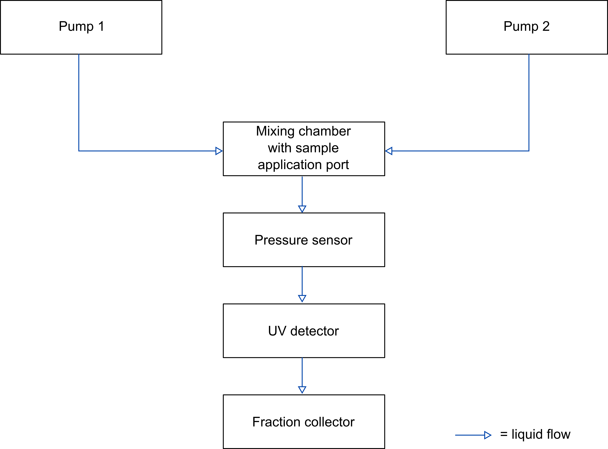

## Open-source pressurised liquid chromatography system for the purification of proteins and small molecules

## Synopsis

Column chromatography is a routine technique for the separation of components from complex mixtures. In biochemistry and molecular biology, the most common application is the purification of recombinantly expressed proteins from in vitro or in vivo expression systems. These separations are currently performed by gravity flow, centrifugation or by using automated systems that use pumps to force solutions over a column. 

Gravity flow and centrifugation techniques, while simple and relatively inexpensive, are labour intensive and time consuming. Conversely, commercial systems allow a high degree of automation, limiting hands-on time, and allow more complex elution protocols, such as elution using salt or pH gradients. However, these systems require specialised, expensive equipment. The project proposed here aims to produce a lower cost, modular, open-source alternative to these commercial systems for performing simple, routine purifications.

## Overview Diagram

Diagram showing a high-level overview of the system. A typical method run for purification of a protein (preprogrammed in method runs) is as follows:
1) Connection of a chromatography column appropriate for the purification between the pressure sensor and UV sensor
2) Equilibration (conditioning) of the column using equilbration/wash buffer from pump 1
3) Loading of the sample through the sample application port on the mixing chamber
4) Washing of unbound material using equilbration/wash buffer from pump 1
5) Elution of the protein of interest from the column using elution buffer from pump 2
6) Steps 4 and 5 are accompanied by fractionation (separation of components) into different wells of a 96-well plate using the fraction collector

This project is a work in progress. For each component, navigate to the component folder for a list of known bugs and planned future improvements.

## Software
The project contains four Arduinos, one in each of two pumps, one in the fraction collector (SCARA arm) and one in the control unit. The control unit coordinates the other Arduinos and also reads out pressure sensor and UV sensor data. The SCARA arm Arduino controls the movements of the arm on prompting from the control unit over I2C. Pump Arduinos control the movement of the pumps after prompting by the control unit over I2C. For details of the software for each component, see the individual component folders.

## Hardware

The project contains different hardware modules, which are coordinated by the control module. For CAD files and diagrams, see individual component folders.

## Installation, Maintenance and Testing Guide

See individual component folders.

## Licenses

Hardware is distributed under the Creative Commons share alike license (see Thingiverse links). 
All software is available under the GNU General Public License Version 3 (https://www.gnu.org/licenses/gpl.html).

This project makes use of the following non-standard Arduino libraries, which are distributed under the indicated licenses:
1) Grove_LCD_RGB_backlight library - The MIT License (MIT) - Copyright (c) 2013 Seeed Technology Inc
2) MS5803-14 Master library for MS5803 14bar pressure sensor module - by Luke Miller (http://github.com/millerlp) -GNU General Public License Version 3

