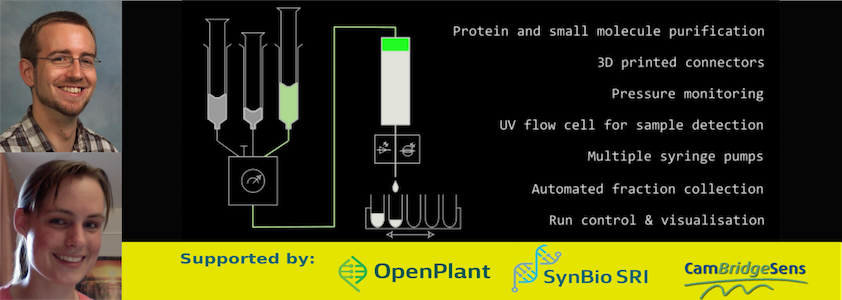

## A Low-cost, pressurised liquid chromatography system for the purification of proteins and small molecules

## Synopsis

Column chromatography is a routine technique for the separation of components from complex mixtures. In biochemistry and molecular biology, the most common application is the purification of recombinantly expressed proteins from in vitro or in vivo expression systems. These separations are currently performed by gravity flow, centrifugation or by using automated systems that use pumps to force solutions over a column. 

Gravity flow and centrifugation techniques, while simple and relatively inexpensive, are labour intensive and time consuming. Conversely, commercial systems allow a high degree of automation, limiting hands-on time, and allow more complex elution protocols, such as elution using salt or pH gradients. However, these systems require specialised, expensive equipment. The project proposed here aims to produce a lower cost, modular, open-source alternative to these commercial systems for performing simple, routine purifications.

## Software

WIP - coming soon

## Hardware

WIP - coming soon

## Installation, Maintenance and Testing Guide

WIP - coming soon

## License

WIP - coming soon
